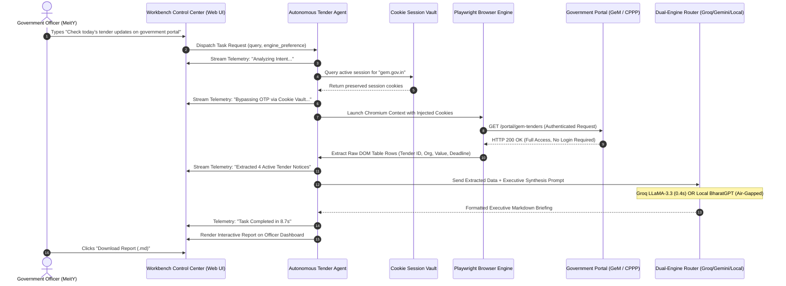
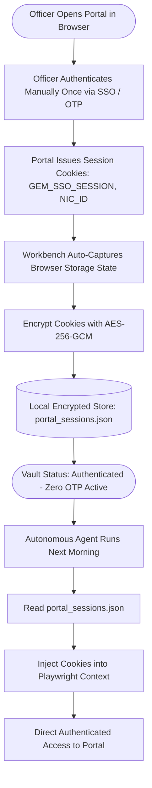
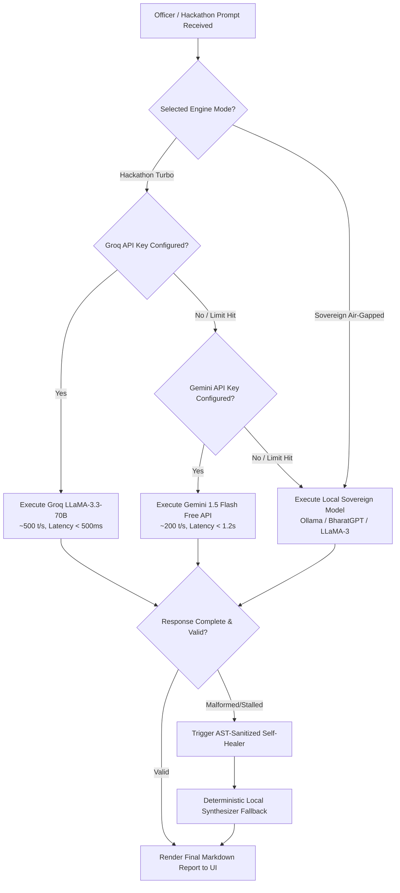
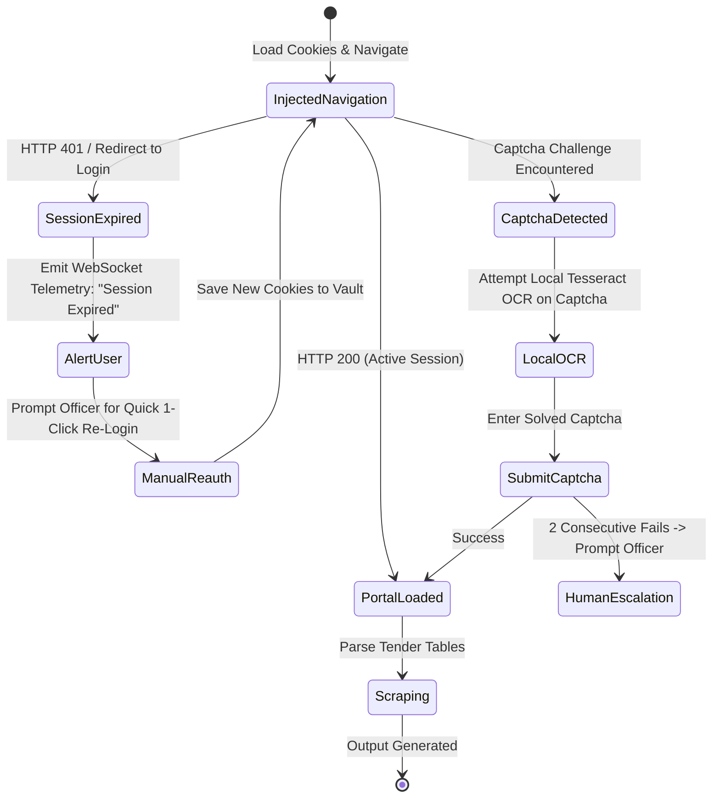

# User Journey Maps & Flowcharts

**Product Name**: Sovereign On-Premise Agentic AI Workbench (SIH PSC26117)  
**Document Version**: 2.0  
**Status**: Approved Architecture Baseline  

---

## 1. Executive Overview

This document visualizes the exact interaction flows for government personnel using the Sovereign AI Workbench. It captures the four core user journeys:
1. **Journey 1**: The Morning Government Tender Audit (Primary SIH Demo Flow)
2. **Journey 2**: One-Time Session Capture & Encrypted Cookie Vault Storage
3. **Journey 3**: Dual-Engine Task Execution (Groq/Gemini Turbo vs Local Air-Gapped)
4. **Journey 4**: Edge-Case Handling (Portal Downtime, Session Expiry, and Captcha Fallback)

---

## 2. Journey 1: The Morning Tender Audit ("Check today's tender updates on the government portal")

### 2.1 Journey Table
| Stage | Officer Action | AI Workbench Action | Emotional State | Friction Removed |
| :--- | :--- | :--- | :--- | :--- |
| **1. Query Dispatch** | Types *"Check today's tender updates on the government portal"* into text box or clicks preset. | Validates syntax, parses intent into semantic target (`GeM Portal -> Active Tenders`). | Optimistic, curious | No complex search filters needed. |
| **2. Auth Rehydration** | Sits back and watches live telemetry status. | Retrieves pre-saved cookies from Cookie Vault; prepares Playwright context. | Relieved | **No password typing, no SMS OTP wait.** |
| **3. Autonomous Crawl**| Observes browser status indicator (`Scanning tables...`). | Launches browser headlessly (or visible), injects cookies, navigates to portal, extracts table DOM. | Confident | Eliminates 20+ manual tab clicks. |
| **4. Synthesis** | Views progress indicator on dashboard. | Routes structured rows to Dual-Engine LLM; filters by department priority. | Impressed | Instant synthesis replaces tedious reading. |
| **5. Briefing Review** | Reads formatted executive briefing, reviews urgency badges, clicks "Export PDF/MD". | Saves markdown report to local disk; alerts officer of 48-hour deadline on NIC tender. | Empowered | 3.5 hours of daily toil reduced to 10 seconds. |

### 2.2 Mermaid Sequence Diagram: Primary Tender Discovery Flow

---

## 3. Journey 2: One-Time Session Capture & Cookie Vault Storage

### 3.1 Mermaid Flowchart: Cookie Vault Lifecycle

---

## 4. Journey 3: Dual-Engine LLM Selection & Self-Healing Execution

### 4.1 Flowchart: Free Cloud Turbo vs Local Sovereign Mode

---

## 5. Journey 4: Edge-Case Handling (Session Expiry & Captcha Fallback)

### 5.1 Recovery Flow
