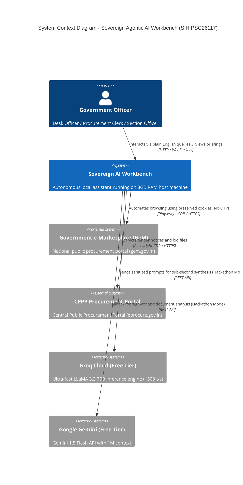
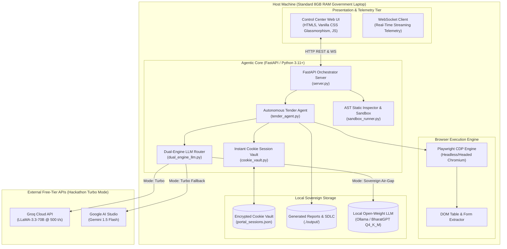

# System Architecture Diagram (High-Level)

**Product Name**: Sovereign On-Premise Agentic AI Workbench (SIH PSC26117)  
**Document Version**: 2.0  
**Scope**: C4 System Context, Container & Component Topology  

---

## 1. Architectural Principles

1. **Dual-Engine Flexibility ($0 Cost)**: High-speed cloud free APIs (Groq LLaMA-3.3-70B & Google Gemini Flash) for hackathon judging, paired with air-gapped on-premise open-weight LLMs (BharatGPT / Ollama) for sovereign deployments.
2. **Strict Host Boundary (Air-Gapped Sovereign Mode)**: In sovereign mode, zero bytes leave the physical machine. All vector embeddings, cookies, logs, and inferences remain local.
3. **Instant Cookie-Driven Authentication**: Bypass multi-factor authentication (MFA) bottlenecks via local AES-256 cookie vault injection.
4. **Sandboxed AST Execution**: All self-repair code is inspected by a static Abstract Syntax Tree (AST) analyzer before execution to prevent malicious OS operations.

---

## 2. C4 Context Diagram (System Context)

---

## 3. C4 Container Diagram (Workbench Subsystems)

---

## 4. Component Topology & Data Flow

1. **Client Command Dispatch**: User enters prompt on Web UI. Sent via `/api/workbench/run-task`.
2. **Session Vault Access**: `TenderAgent` requests authenticated cookies from `CookieVault` matching the portal domain.
3. **Browser Context Rehydration**: Playwright initializes an isolated Chromium context and injects cookies, bypassing all SMS/email OTP prompts.
4. **Autonomous Navigation & Extraction**: Chromium loads the target portal table, extracts row cells (Tender ID, Ministry, Value, Deadline), and closes the context.
5. **Dual-Engine Synthesis**:
   - In **Hackathon Turbo Mode**, the structured payload is dispatched to Groq API (`llama-3.3-70b-versatile`), returning an executive intelligence briefing in ~400ms.
   - In **Sovereign Air-Gapped Mode**, the payload routes directly to local Ollama/BharatGPT on `http://127.0.0.1:11434`.
6. **Telemetry & Rendering**: Step-by-step execution status is streamed via WebSockets to the Web UI, rendering the final briefing on the officer's dashboard.