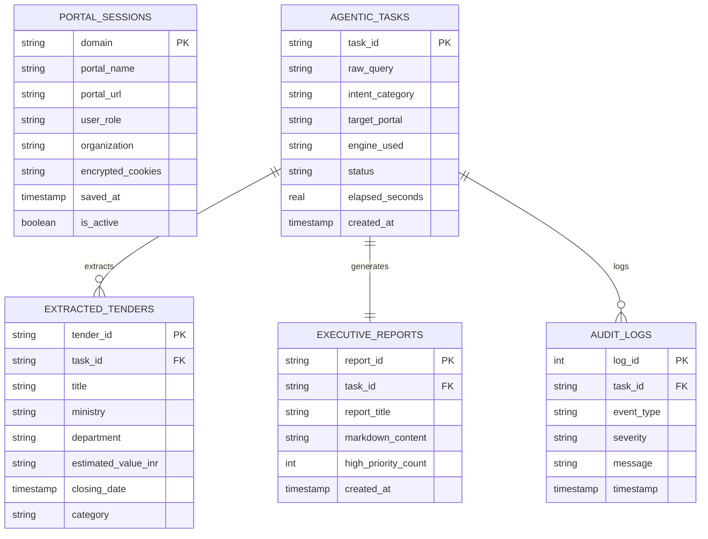
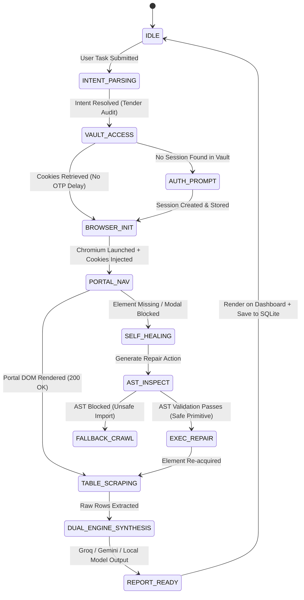
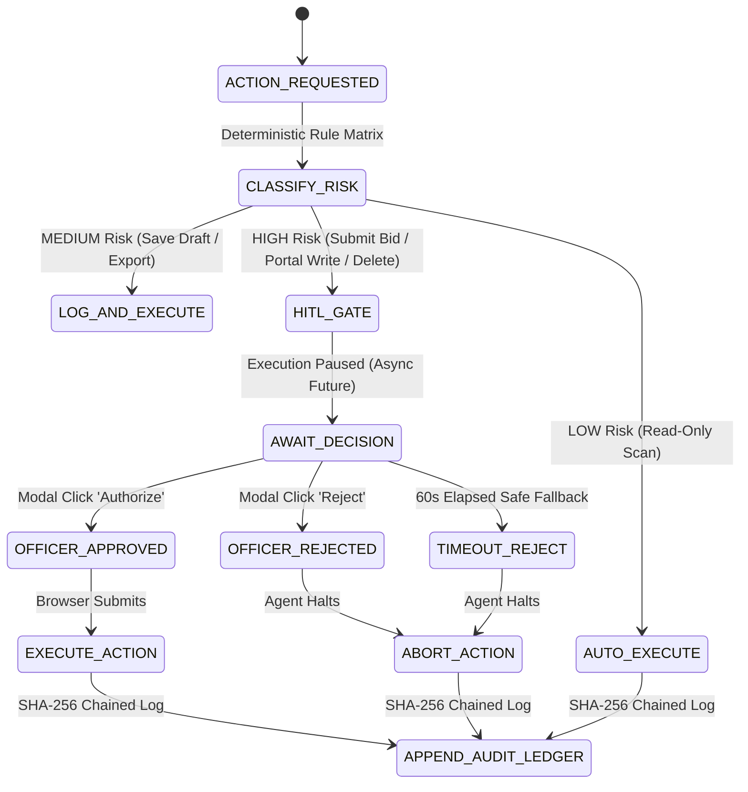

# Detailed Design Document (Low-Level)

**Product Name**: Sovereign On-Premise Agentic AI Workbench (SIH PSC26117)  
**Document Version**: 2.0  
**Scope**: Database DDL Schemas, Encryption Specifications, State Machine (FSM) & Component Interactions  

---

## 1. Database Schema & Data Models (SQLite DDL)

The workbench utilizes an embedded, single-file SQLite database (`sovereign_workbench.db`) with WAL (Write-Ahead Logging) enabled for zero-maintenance, high-concurrency ACID transactions.

### 1.1 Complete Relational DDL
```sql
-- PRAGMA configuration for optimal local performance
PRAGMA journal_mode = WAL;
PRAGMA foreign_keys = ON;
PRAGMA synchronous = NORMAL;

-- Table: Portal Sessions (Encrypted Cookie Vault)
CREATE TABLE IF NOT EXISTS portal_sessions (
    domain VARCHAR(255) PRIMARY KEY,
    portal_name VARCHAR(255) NOT NULL,
    portal_url TEXT NOT NULL,
    user_role VARCHAR(100) NOT NULL,
    organization VARCHAR(255) NOT NULL,
    encrypted_cookies TEXT NOT NULL, -- AES-256-GCM cipher payload
    iv_base64 VARCHAR(64) NOT NULL,
    auth_tag_base64 VARCHAR(64) NOT NULL,
    saved_at TIMESTAMP DEFAULT CURRENT_TIMESTAMP,
    last_verified_at TIMESTAMP DEFAULT CURRENT_TIMESTAMP,
    is_active BOOLEAN DEFAULT 1
);

-- Table: Agentic Tasks
CREATE TABLE IF NOT EXISTS agentic_tasks (
    task_id VARCHAR(64) PRIMARY KEY,
    raw_query TEXT NOT NULL,
    intent_category VARCHAR(64) NOT NULL, -- 'TENDER_AUDIT', 'FORM_FILL', 'DATA_EXTRACTION'
    target_portal VARCHAR(255),
    engine_used VARCHAR(64) NOT NULL,     -- 'GROQ_TURBO', 'GEMINI_FLASH', 'LOCAL_SOVEREIGN'
    status VARCHAR(32) NOT NULL,          -- 'PENDING', 'RUNNING', 'COMPLETED', 'FAILED'
    elapsed_seconds REAL DEFAULT 0.0,
    created_at TIMESTAMP DEFAULT CURRENT_TIMESTAMP,
    completed_at TIMESTAMP
);

-- Table: Extracted Tender Records
CREATE TABLE IF NOT EXISTS extracted_tenders (
    tender_id VARCHAR(128) PRIMARY KEY,
    task_id VARCHAR(64) NOT NULL,
    title TEXT NOT NULL,
    ministry VARCHAR(255) NOT NULL,
    department VARCHAR(255),
    estimated_value_inr TEXT,
    publish_date DATE,
    closing_date TIMESTAMP,
    category VARCHAR(128),
    eligibility_notes TEXT,
    scraped_at TIMESTAMP DEFAULT CURRENT_TIMESTAMP,
    FOREIGN KEY (task_id) REFERENCES agentic_tasks(task_id) ON DELETE CASCADE
);

-- Table: Executive Reports
CREATE TABLE IF NOT EXISTS executive_reports (
    report_id VARCHAR(64) PRIMARY KEY,
    task_id VARCHAR(64) NOT NULL UNIQUE,
    report_title TEXT NOT NULL,
    markdown_content TEXT NOT NULL,
    key_findings_json TEXT,
    high_priority_count INTEGER DEFAULT 0,
    created_at TIMESTAMP DEFAULT CURRENT_TIMESTAMP,
    FOREIGN KEY (task_id) REFERENCES agentic_tasks(task_id) ON DELETE CASCADE
);

-- Table: Security & Execution Audit Log
CREATE TABLE IF NOT EXISTS audit_logs (
    log_id INTEGER PRIMARY KEY AUTOINCREMENT,
    task_id VARCHAR(64),
    event_type VARCHAR(64) NOT NULL,      -- 'COOKIE_INJECT', 'PORTAL_ACCESS', 'LLM_CALL', 'SANDBOX_CHECK'
    severity VARCHAR(16) DEFAULT 'INFO',  -- 'INFO', 'WARNING', 'ERROR'
    message TEXT NOT NULL,
    metadata_json TEXT,
    timestamp TIMESTAMP DEFAULT CURRENT_TIMESTAMP
);

CREATE INDEX IF NOT EXISTS idx_tenders_task ON extracted_tenders(task_id);
CREATE INDEX IF NOT EXISTS idx_tasks_status ON agentic_tasks(status);
```

---

## 2. Mermaid Entity-Relationship (ER) Diagram



---

## 3. Finite State Machine (FSM): Agentic Execution & Self-Healing



---

## 4. AES-256-GCM Cookie Vault Encryption Protocol

To guarantee that preserved login sessions are never stored in plaintext on disk, the `CookieVault` applies AES-256-GCM authenticated encryption:
1. **Key Derivation**: A 256-bit symmetric key derived from host-bound hardware tokens (Motherboard UUID + Machine ID) using PBKDF2 with 100,000 SHA-256 iterations.
2. **Initialization Vector (IV)**: A unique 96-bit cryptographically secure random nonce generated per write operation.
3. **Authenticated Tag**: 128-bit authentication tag ensuring ciphertext integrity and detecting tampering.

---

## 5. Provenance, Verification & Human-in-the-Loop Governance Subsystems

### 5.1 Evidence Citation Schema & Provenance Graph
- **Citation Structure**:
  ```json
  {
    "citation_id": "SRC-1-1",
    "document_id": "a9f8...",
    "document_name": "Tender_GeM_Bid_9941.pdf",
    "page_number": 4,
    "section_id": "Clause 2.1",
    "snippet": "Earnest money deposit (EMD) is INR 50,00,000 payable via Bank Guarantee.",
    "snippet_sha256": "4b68e916...",
    "relevance_score": 92.5
  }
  ```
- **Coverage Policy**: If `<meaningful_query_words>` matched against citations is `< 30%`, the system transitions to `INSUFFICIENT_EVIDENCE` and abstains from synthesis.

### 5.2 Deterministic Claim Verification
- **Regex Fact Extraction**: Analyzes currency (`INR`, `₹`), numerical turnover bounds, percentages, and deadlines.
- **Cross-Document Check**: If any extracted figure in generated text fails to appear in the source passage corpus, the result is flagged as `CONTRADICTED` with `requires_human_review = True`.

### 5.3 Governed Agent Execution & Approval FSM


### 5.4 SHA-256 Tamper-Evident Chained Audit Ledger
Each block links cryptographically:
$$\text{event\_hash}_n = \text{SHA256}(\text{event\_id} \parallel \text{timestamp} \parallel \text{action} \parallel \text{prev\_hash}_{n-1} \parallel \text{clean\_details})$$
Redacts all passwords, cookies, authorization tokens, and private keys before hashing and writing to disk.